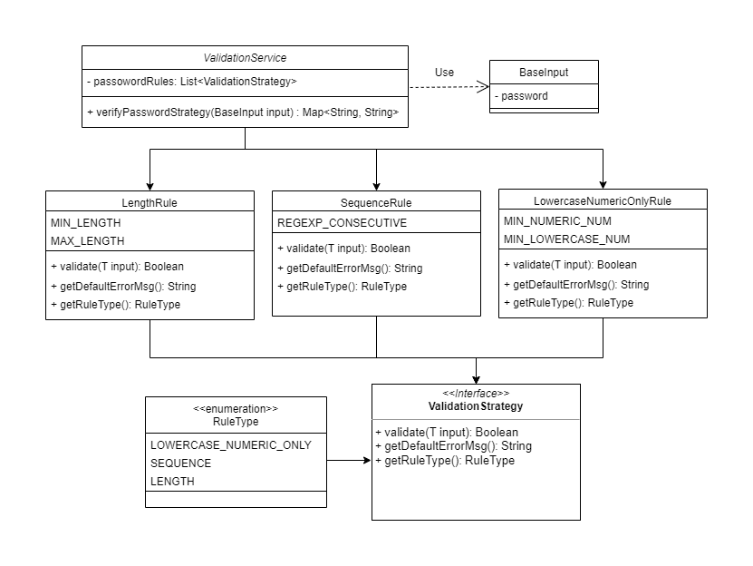

# validation-demo

### Intro

As per the requirement, the validation for each rule will be different and we may need to extend the validations for
more rules in the future. Hence, the best approach will be to use the Strategy pattern. 
I try to create with the usual **Class way** of implementation.

The structure is presented in the picture below.



The several Rules object implements interface ValidationStrategy, 
and each rule will override with 3 methods to do the customized job in the validation process. 

### Extensible & Maintainable

The class ValidationService like a container to inject all of ValidationStrategies with @Autowired.
so that we could handle validation types whatever we want. To accomplish customized validation on any single fields/details.


#### src\main\java\com\innova\ds\service\ValidationService.java
```
    
    @Autowired
    private List<ValidationStrategy> passwordRules;
    .
    ..
    ...
    public Map<String, String> verifyPasswordStrategy(BaseInput baseInput) {
        Map<String, String> errMsgMap = new LinkedHashMap<>();
        for(ValidationStrategy passwordValidation : passwordRules) {
            if (!passwordValidation.validate(baseInput)) {
                errMsgMap.put(passwordValidation.getRuleType().name(),
                              passwordValidation.getDefaultErrorMsg());
            }
        }
        return errMsgMap;
    }
    
```

If user wants to add any rules into the validation process, They could just create new rule object which implements 
interface ValidationStrategy to raise entire fresh validation process. 

### Example

#### Url:
```
POST http://localhost:8080/api/verify/password
```
#### Body:
```
{
    "password": "<input String>"
}
```

Hit the API via postman with **Url** above, we could get the error fields below. 
If Results are empty, **_means it passed all the validation!_**

#### Successful Results:
```
{

}
```

#### Failure Results:
```
{
    "LOWERCASE_NUMERIC_ONLY": "alphabetical lowercase & numeric character only.",
    "LENGTH_RANGE": "Failed length requirement.",
    "MIN_LOWERCASE": "must contain at least one alphabetical lowercase character.",
    "MIN_NUMERIC": "must contain at least one numeric character.",
    "NO_SEQUENCE": "must not contain any repeating substrings of two characters or more"
}
```


